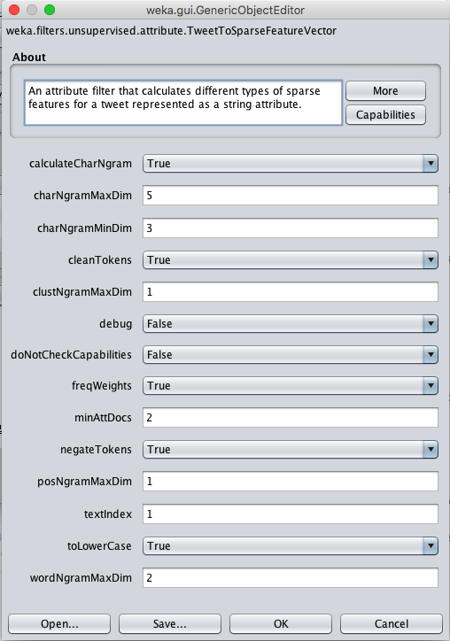

 

## About

[AffectiveTweets](http://weka.sourceforge.net/packageMetaData/AffectiveTweets/index.html) is a [WEKA](http://www.cs.waikato.ac.nz/~ml/weka/) package for analyzing emotion and sentiment of English written tweets. The package is the official baseline system for the  [WASSA-2017](http://optima.jrc.it/wassa2017/) Shared Task on Emotion Intensity [(EmoInt)](http://saifmohammad.com/WebPages/EmotionIntensity-SharedTask.html).  Instructions for using the system with the task data are available [here](https://github.com/felipebravom/EmoInt#2-weka-baseline-system).

The package implements WEKA filters for converting tweets contained in string attributes into feature vectors that can be fed into machine learning algorithms. Description about the filters, installation instructions, and sentiment classification examples are given below.


## Citation
Please cite the following paper if using this package in an academic publication:

* __Emotion Intensities in Tweets__. Saif M. Mohammad and Felipe Bravo-Marquez. In Proceedings of the Joint Conference on Lexical and Computational Semantics (*Sem), August 2017, Vancouver, Canada. 

You should also cite the papers describing any of the lexicons or resources you are using with this package. The corresponding references can be found on the links provided along with each feature description.

### Filters

1. __TweetToSparseFeatureVector__: calculates sparse features, such as word and character n-grams from tweets. There are parameters for filtering out infrequent features e.g., (n-grams occurring in less than *m* tweets) and for setting the weighting approach  (boolean or frequency based).
 * __Word n-grams__: extracts word n-grams from *n*=1 to a maximum value. 
 * __Negations__: add a prefix to words occurring in negated contexts, e.g., I don't like you => I don't NEG-like NEG-you. The prefixes only affect word n-gram features. The scope of negation finishes with the next punctuation expression *([\\.|,|:|;|!|\\?]+)* .
 * __Character n-grams__: calculates character n-grams.
 * __POS tags__: tags tweets using the [CMU Tweet NLP tool](http://www.cs.cmu.edu/~ark/TweetNLP/), and creates a vector space model based on the sequence of POS tags. 
 * __Brown clusters__: maps the words in a tweet to Brown word clusters and creates a low-dimensional vector space model. It can be used with n-grams of word clusters. The word clusters are also taken from the [CMU Tweet NLP tool](http://www.cs.cmu.edu/~ark/TweetNLP/).

2. __TweetToLexiconFeatureVector__: calculates features from a tweet using several lexicons.
 * [MPQA](http://mpqa.cs.pitt.edu/lexicons/subj_lexicon): counts the number of positive and negative words from the MPQA subjectivity lexicon.
 * [Bing Liu](https://www.cs.uic.edu/~liub/FBS/sentiment-analysis.html#lexicon): counts the number of positive and negative words from the Bing Liu lexicon.
 * [AFINN](https://github.com/fnielsen/afinn): calculates positive and negative variables by aggregating the positive and negative word scores provided by this lexicon.
 * [Sentiment140](http://saifmohammad.com/WebPages/lexicons.html): calculates positive and negative variables by aggregating the positive and negative word scores provided by this lexicon created with tweets annotated by emoticons. 
 * [NRC Hashtag Sentiment lexicon](http://saifmohammad.com/WebPages/lexicons.html): calculates positive and negative variables by aggregating the positive and negative word scores provided by this lexicon created with tweets annotated with emotional hashtags. 
 * [NRC Word-Emotion Association Lexicon](http://saifmohammad.com/WebPages/NRC-Emotion-Lexicon.htm): counts the number of words matching each emotion from this lexicon.
 * [NRC-10 Expanded](http://www.cs.waikato.ac.nz/ml/sa/lex.html#emolextwitter): adds the emotion associations of the words matching the Twitter Specific expansion of the NRC Word-Emotion Association Lexicon.
 * [NRC Hashtag Emotion Association Lexicon](http://saifmohammad.com/WebPages/lexicons.html): adds the emotion associations of the words matching this lexicon.  
 * [SentiWordNet](http://sentiwordnet.isti.cnr.it): calculates positive and negative scores using SentiWordnet. We calculate a weighted average of the sentiment distributions of the synsets for word occurring in multiple synsets. The weights correspond to the reciprocal ranks of the senses in order to give higher weights to most popular senses. 
 * [Emoticons](https://github.com/fnielsen/afinn): calculates a positive and a negative score by aggregating the word associations provided by a list of emoticons. The list is taken from the [AFINN](https://github.com/fnielsen/afinn) project.
 * Negations: counts the number of negating words in the tweet.
 
3. __TweetToSentiStrengthFeatureVector__: calculates positive and negative sentiment strengths for a tweet using [SentiStrength](http://sentistrength.wlv.ac.uk/). Disclaimer: __SentiStrength__ can only be used for academic purposes from within this package.
 
4. __TweetToEmbeddingsFeatureVector__: calculates a tweet-level feature representation using pre-trained word embeddings. A dummy word-embedding formed by zeroes is used for word with no corresponding embedding. The tweet vectors can be calculated using the following schemes: 
 * Average word embeddings.
 * Add word embeddings. 
 * Concatenation of first *k* embeddings. Dummy values are added if the tweet has less than *k* words. 


### Tokenizers

1. __TweetNLPTokenizer__: a Twitter-specific String tokenizer based on the [CMU Tweet NLP tool](http://www.cs.cmu.edu/~ark/TweetNLP/) that can be used with the existing [StringWordToVector](http://weka.sourceforge.net/doc.dev/weka/filters/unsupervised/attribute/StringToWordVector.html) Weka filter. 

### Other Resources

1. __Datasets__: The package provides some tweets annotated by affective values in gzipped [ARFF](http://weka.wikispaces.com/ARFF) format in $WEKA_HOME/packages/AffectiveTweets/data/. The default location for $WEKA_HOME is $HOME/wekafiles. 
2. __Pre-trained Word-Embeddings__: The package provides a file with pre-trained word vectors trained with the [Word2Vec](https://code.google.com/archive/p/word2vec/) tool in gzip compressed format. It is a tab separated file with the word in last column located in $WEKA_HOME/packages/AffectiveTweets/resources/w2v.twitter.edinburgh.100d.csv.gz. However, this is a toy example trained from a small collection of tweets. We recommend downloading [w2v.twitter.edinburgh10M.400d.csv.gz](https://github.com/felipebravom/AffectiveTweets/releases/download/1.0.0/w2v.twitter.edinburgh10M.400d.csv.gz), which provides  embeddings trained from 10 million tweets taken from the [Edinburgh corpus](http://www.aclweb.org/anthology/W/W10/W10-0513.pdf). The parameters were calibrated for classifying words into emotions. More info in this [paper](http://www.cs.waikato.ac.nz/~fjb11/publications/wi2016a.pdf).
 
## Installation

* Download the latest stable [version](http://www.cs.waikato.ac.nz/ml/weka/downloading.html) or the  developer [branch](http://www.cs.waikato.ac.nz/ml/weka/snapshots/weka_snapshots.html) of Weka.
You can also build the developer branch from the SVN repository: 

```bash
svn co https://svn.cms.waikato.ac.nz/svn/weka/trunk/weka/
ant -f weka/build.xml exejar
```

* Install AffectiveTweets using the [WekaPackageManager](http://weka.wikispaces.com/How+do+I+use+the+package+manager%3F): 

```bash
java -cp weka.jar weka.core.WekaPackageManager -install-package AffectiveTweets
```

* (Optional) Install other useful packages for classification, regression and evaluation:

```bash
java -cp weka.jar weka.core.WekaPackageManager -install-package LibLINEAR
java -cp weka.jar weka.core.WekaPackageManager -install-package LibSVM
java -cp weka.jar weka.core.WekaPackageManager -install-package RankCorrelation
```


## Examples
The package can be used from the Weka GUI or the command line.

### GUI 

Run WEKA and open the Explorer:  
 ```
 java -Xmx4G -jar weka.jar 
```

Note: The -Xmx parameter allows incrementing the memory available for the Java virtual machine. It is strongly recommend to allocate as much memory as possible for large datasets or when calculating large dimensional features, such as word n-grams. More info at: http://weka.wikispaces.com/OutOfMemoryException .

#### Train an SVM using sparse features:

* Open in the preprocess panel the __sent140test.arff.gz__ dataset located in HOME/wekafiles/packages/AffectiveTweets/data/. Note: Select arff.gz files in the *Files of Type* option. 

* Choose the *TweetToSparseFeatureVector* filter and configure it for calculating word n-grams, character n-grams, Brown word clusters, and POS tags:

 <p align="center">
  
 </p>

* Train an SVM using LibLinear. Go to the *classify* panel and select the target class as the variable (Nom) class. 
 
* Right click on the panel right to the *Choose* button and click on the *Edit Configuration option*. Paste the following snippet:
 
 ```
 weka.classifiers.meta.FilteredClassifier -F "weka.filters.unsupervised.attribute.RemoveType -T string" -W    weka.classifiers.functions.LibLINEAR -- -S 1 -C 1.0 -E 0.001 -B 1.0 -L 0.1 -I 1000
 ``` 

 Note: Weka allows copying and pasting the configuration of its objets. This is very convenient when training complex schemes with various parameters.  The FilteredClassfier allows directly  passing a filter to the classifier. In this example, we are removing the attributes of type string.
 
* Select the Percentage split option and start training the classifier. 

#### Train an SVM using multiple opinion lexicons, SentiStrength, and the average word-embedding vector:
* Go back to the preprocess panel and press the *Undo* button to go back to the original dataset (or load the __sent140test.arff.gz__ dataset in case you skipped the first example).
* Go to the *Classify* panel and paste the following snippet in the classifier's configuration:

 ```
 weka.classifiers.meta.FilteredClassifier -F "weka.filters.MultiFilter -F \"weka.filters.unsupervised.attribute.TweetToSentiStrengthFeatureVector -I 1 -U -O\" -F \"weka.filters.unsupervised.attribute.TweetToEmbeddingsFeatureVector -I 1 -B $HOME/wekafiles/packages/AffectiveTweets/resources/w2v.twitter.edinburgh.100d.csv.gz -S 0 -K 15 -L -O\" -F \"weka.filters.unsupervised.attribute.TweetToLexiconFeatureVector -I 1 -A -D -F -H -J -L -N -P -Q -R -T -U -O\" -F \"weka.filters.unsupervised.attribute.Reorder -R 4-last,3\"" -W weka.classifiers.functions.LibLINEAR -- -S 1 -C 1.0 -E 0.001 -B 1.0 -L 0.1 -I 1000
```
 Note: make sure that the word embeddings file is correctly specified. 

* We are using the MultiFilter filter to nest multiple filters.  The Reorder filter is used to discard the first two String attributes and moving the class label to the last position.

* Now you can train the classifier by pressing the *Start* button. 


#### Train a Convolution Neural Network on the concatenation of word embeddings:
In this example we will show how to train a convolution neural network with a similar arquitecture to the one used in this [paper](http://dl.acm.org/citation.cfm?doid=2766462.2767830) using the *WekaDeepLearning4j* package, which is a wrapper of the [DeepLearning4j](https://deeplearning4j.org/) library. 

* First, install the package:

```bash
# For CPU
java -cp weka.jar weka.core.WekaPackageManager -install-package WekaDeepLearning4jCPU

# For GPU
java -cp weka.jar weka.core.WekaPackageManager -install-package WekaDeepLearning4jGPU
```

* Represent each tweet from the __sent140test.arff.gz__  dataset as a sequence of its first 15 word embeddings by pasting the following filter configuration:

```bash
weka.filters.unsupervised.attribute.TweetToEmbeddingsFeatureVector -I 1 -B /Users/admin/wekafiles/packages/AffectiveTweets/resources/w2v.twitter.edinburgh.100d.csv.gz -S 2 -K 15 -L -O
```

* Discard the string content and move the class label to the last position:

```bash
weka.filters.unsupervised.attribute.Reorder -R 4-last,3
```

* Train a convolutional neural network using a *Dl4jMlpClassifier*. Paste the following snippet in the Classification panel: 

```bash
weka.classifiers.functions.Dl4jMlpClassifier -S 1 -iterator "weka.dl4j.iterators.ConvolutionalInstancesIterator -height 1 -numChannels 1 -bs 256 -width 1500" -layers "weka.dl4j.layers.ConvolutionLayer -nFilters 100 -activation identity -adamMeanDecay 0.9 -adamVarDecay 0.999 -biasInit 1.0 -biasL1 0.0 -biasL2 0.0 -blr 0.01 -mode Truncate -cudnnAlgoMode PREFER_FASTEST -dist \"weka.dl4j.distribution.NormalDistribution -mean 0.001 -std 1.0\" -dropout 0.0 -epsilon 1.0E-6 -gradientNormalization None -gradNormThreshold 1.0 -kernelSizeX 300 -kernelSizeY 1 -L1 0.0 -L2 0.0 -name \"Convolution layer\" -lr 0.01 -momentum 0.9 -paddingX 0 -paddingY 0 -rho 0.0 -rmsDecay 0.95 -strideX 100 -strideY 1 -updater NESTEROVS -weightInit XAVIER" -layers "weka.dl4j.layers.OutputLayer -activation softmax -adamMeanDecay 0.9 -adamVarDecay 0.999 -biasInit 1.0 -biasL1 0.0 -biasL2 0.0 -blr 0.01 -dist \"weka.dl4j.distribution.NormalDistribution -mean 0.001 -std 1.0\" -dropout 0.0 -epsilon 1.0E-6 -gradientNormalization None -gradNormThreshold 1.0 -L1 0.0 -L2 0.0 -name \"Output layer\" -lr 0.01 -lossFn LossMCXENT() -momentum 0.9 -rho 0.0 -rmsDecay 0.95 -updater NESTEROVS -weightInit XAVIER" -logFile weka.log -numEpochs 200 -algorithm STOCHASTIC_GRADIENT_DESCENT
```

This network has 100 filters in a convolutional layer, followed by the output layer. The filter size is 300x1 (i.e, each filter maps a word trigram, since each word has 100 dimensions). The stride is 100x1 (the number of dimensions for a word). The number of epochs is 200. The input width is 1500 and the input height is 1. The number of input channels is 1 and the batch size is 256.


### Command-line 

The same classification schemes can be run from the command line. An example using word embeddings is given below:

 ```bash
java -Xmx4G -cp weka.jar weka.Run weka.classifiers.meta.FilteredClassifier -t $HOME/wekafiles/packages/AffectiveTweets/data/sent140test.arff.gz -split-percentage 66 -F "weka.filters.MultiFilter -F \"weka.filters.unsupervised.attribute.TweetToEmbeddingsFeatureVector -I 1 -B $HOME/wekafiles/packages/AffectiveTweets/resources/w2v.twitter.edinburgh.100d.csv.gz -S 0 -K 15 -L -O\" -F \"weka.filters.unsupervised.attribute.Reorder -R 4-last,3\"" -W weka.classifiers.functions.LibLINEAR -- -S 1 -C 1.0 -E 0.001 -B 1.0 -L 0.1 -I 1000
```


## Contact
* This package was developed by [Felipe Bravo-Marquez](http://www.cs.waikato.ac.nz/~fjb11/). 
* Email: fjb11 at students.waikato.ac.nz
* If you have questions about Weka please refer to the Weka [mailing list](https://list.waikato.ac.nz/mailman/listinfo/wekalist). 


