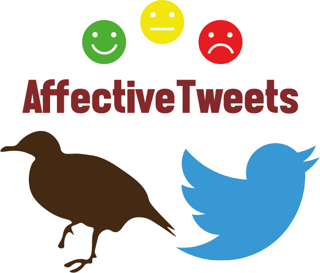

 

## About

[AffectiveTweets](https://affectivetweets.cms.waikato.ac.nz/) is a [WEKA](http://www.cs.waikato.ac.nz/~ml/weka/) package for analyzing emotion and sentiment of English written tweets. 

The package implements WEKA filters for calculating state-of-the-art affective analysis features from tweets that can be fed into machine learning algorithms. Many of these features were drawn from the [NRC-Canada System](http://saifmohammad.com/WebPages/NRC-Canada-Sentiment.htm). It also implements methods for building affective lexicons and distant supervision methods for training affective models from unlabelled tweets.

The package was made available as the official baseline system for the [WASSA-2017](http://optima.jrc.it/wassa2017/) Shared Task on Emotion Intensity [(EmoInt)](http://saifmohammad.com/WebPages/EmotionIntensity-SharedTask.html) and for [SemEval-2018](http://alt.qcri.org/semeval2018/) Task 1: [Affect in Tweets](http://www.saifmohammad.com/WebPages/affectintweets.htm). 

Five participating teams used AffectiveTweets in WASSA-2017 to generate feature vectors, including the teams that eventually ranked first, second, and third. For SemEval-2018, the package was used by 15 teams.

[https://affectivetweets.cms.waikato.ac.nz/](https://affectivetweets.cms.waikato.ac.nz/)

## Using AffectiveTweets

* [About](https://affectivetweets.cms.waikato.ac.nz/#about)
* [Installation](https://affectivetweets.cms.waikato.ac.nz/install/)
* [Examples](https://affectivetweets.cms.waikato.ac.nz/examples/)

## Relevant Papers

The most relevant papers on which this package is based are:

 * [Sentiment Analysis of Short Informal Texts](http://saifmohammad.com/WebDocs/NRC-Sentiment-JAIR-2014.pdf). Svetlana Kiritchenko, Xiaodan Zhu and Saif Mohammad. Journal of Artificial Intelligence Research, volume 50, pages 723-762, August 2014. [BibTeX](http://saifmohammad.com/WebDocs/JAIR14-bibtex.txt)
 * [Meta-Level Sentiment Models for Big Social Data Analysis](http://www.sciencedirect.com/science/article/pii/S0950705114002068). F. Bravo-Marquez, M. Mendoza and B. Poblete. Knowledge-Based Systems Volume 69, October 2014, Pages 86–99. [BibTex](http://dblp.uni-trier.de/rec/bib2/journals/kbs/Bravo-MarquezMP14.bib)
 * [Stance and sentiment in tweets](http://saifmohammad.com/WebDocs/1605.01655v1.pdf). Saif M. Mohammad, Parinaz Sobhani, and Svetlana Kiritchenko. 2017. Special Section of the ACM Transactions on Internet Technology on Argumentation in Social Media 17(3). [BibTeX](http://saifmohammad.com/WebPages/Abstracts/stance-toit.bib.txt)
 * [Sentiment strength detection for the social Web](http://dl.acm.org/citation.cfm?id=2336261). Thelwall, M., Buckley, K., & Paltoglou, G. (2012). Journal of the American Society for Information Science and Technology, 63(1), 163-173. [BibTex](http://dblp.uni-trier.de/rec/bib2/journals/jasis/ThelwallBP12.bib)

## Citation
- Please cite the following paper if using this package in an academic publication:

  - F. Bravo-Marquez, E. Frank, B. Pfahringer, and S. M. Mohammad [AffectiveTweets: a WEKA Package for Analyzing Affect in Tweets](http://jmlr.org/papers/v20/18-450.html), In *Journal of Machine Learning Research* Volume 20(92), pages 1−6, 2019. ([pdf](https://felipebravom.com/publications/jmlr2019.pdf))

  You are also welcome to cite a previous publication describing the package:

  - S. M. Mohammad and F. Bravo-Marquez [Emotion Intensities in Tweets](http://anthology.aclweb.org/S/S17/S17-1007.pdf), In *\*Sem '17: Proceedings of the sixth joint conference on lexical and computational semantics (\*Sem)*, August 2017, Vancouver, Canada. ([pdf](https://felipebravom.com/publications/starsem2017.pdf)) 

You should also cite the papers describing any of the lexicons or resources you are using with this package. 

* Here is the [BibTex](https://affectivetweets.cms.waikato.ac.nz/fullBio.bib.txt) entry for the package along with the entries for the resources included in the package. 

* Here is the [BibTex](https://affectivetweets.cms.waikato.ac.nz/shortBio.bib.txt) entry just for the package.

## Contact
* Email: fbravoma at waikato.ac.nz
* If you have questions about Weka please refer to the Weka [mailing list](https://list.waikato.ac.nz/mailman/listinfo/wekalist). 

