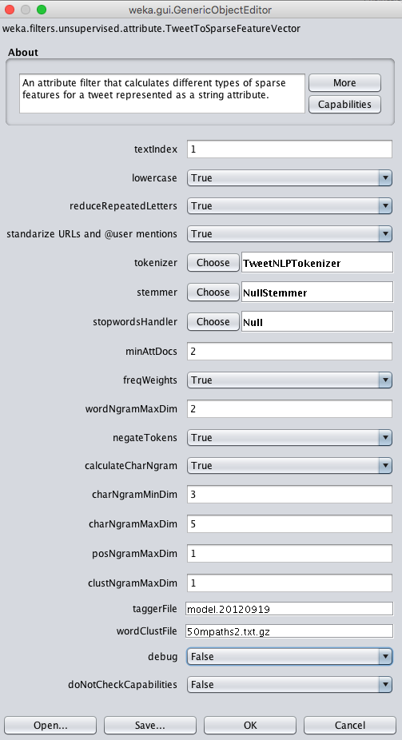

The package can be used from the Weka GUI or the command line.

Note: The following examples work with the newest version of the package. 

## GUI 

Run WEKA and open the Explorer:  
```bash
 java -Xmx4G -jar weka.jar 
```

Note: The -Xmx parameter allows incrementing the memory available for the Java virtual machine. It is strongly recommend to allocate as much memory as possible for large datasets or when calculating large dimensional features, such as word n-grams. More info [here](http://weka.wikispaces.com/OutOfMemoryException).

### Train an SVM using sparse features

* Open in the preprocess panel the __sent140test.arff.gz__ dataset located in HOME/wekafiles/packages/AffectiveTweets/data/. Note: Select arff.gz files in the *Files of Type* option. 

* Choose the *TweetToSparseFeatureVector* filter and configure it for calculating word n-grams, character n-grams, Brown word clusters, and POS tags:





* Train an SVM using LibLinear. Go to the *classify* panel and select the target class as the variable (Nom) class. 

* Right click on the panel right to the *Choose* button and click on the *Edit Configuration option*. Paste the following snippet:

```bash
 weka.classifiers.meta.FilteredClassifier -F "weka.filters.unsupervised.attribute.RemoveType -T string" -W    weka.classifiers.functions.LibLINEAR -- -S 1 -C 1.0 -E 0.001 -B 1.0 -L 0.1 -I 1000
```

 Note: Weka allows copying and pasting the configuration of its objets. This is very convenient when training complex schemes with various parameters.  The FilteredClassfier allows directly  passing a filter to the classifier. In this example, we are removing the attributes of type string.

* Select the Percentage split option and start training the classifier.

Note: This example is also shown in [video 1](../videos/#video-1-training-sentiment-classification-models-for-tweets).

### Train an SVM using multiple affective lexicons, SentiStrength, and the average word-embedding vector
* Go back to the preprocess panel and press the *Undo* button to go back to the original dataset (or load the __sent140test.arff.gz__ dataset in case you skipped the first example).
* Go to the *Classify* panel and paste the following snippet in the classifier's configuration:

```bash
weka.classifiers.meta.FilteredClassifier -F "weka.filters.MultiFilter -F \"weka.filters.unsupervised.attribute.TweetToInputLexiconFeatureVector -lexicon_evaluator \\\"affective.core.ArffLexiconEvaluator -lexiconFile $HOME/wekafiles/packages/AffectiveTweets/lexicons/arff_lexicons/NRC-AffectIntensity-Lexicon.arff -B NRC-Affect-Intensity -A 1 -lex-stemmer weka.core.stemmers.NullStemmer\\\" -red -stan -stemmer weka.core.stemmers.NullStemmer -stopwords-handler \\\"weka.core.stopwords.Null \\\" -I 1 -U -tokenizer \\\"weka.core.tokenizers.TweetNLPTokenizer \\\"\" -F \"weka.filters.unsupervised.attribute.TweetToSentiStrengthFeatureVector -L $HOME/wekafiles/packages/AffectiveTweets/lexicons/SentiStrength/english -red -stan -stemmer weka.core.stemmers.NullStemmer -stopwords-handler \\\"weka.core.stopwords.Null \\\" -I 1 -U -tokenizer \\\"weka.core.tokenizers.TweetNLPTokenizer \\\"\" -F \"weka.filters.unsupervised.attribute.TweetToLexiconFeatureVector -F -D -R -A -T -L -N -P -J -H -Q -red -stan -stemmer weka.core.stemmers.NullStemmer -stopwords-handler \\\"weka.core.stopwords.Null \\\" -I 1 -U -tokenizer \\\"weka.core.tokenizers.TweetNLPTokenizer \\\"\" -F \"weka.filters.unsupervised.attribute.TweetToEmbeddingsFeatureVector -S AVERAGE_ACTION -embeddingHandler \\\"affective.core.CSVEmbeddingHandler -K $HOME/wekafiles/packages/AffectiveTweets/resources/w2v.twitter.edinburgh.100d.csv.gz -sep TAB -I last\\\" -K 15 -red -stan -stemmer weka.core.stemmers.NullStemmer -stopwords-handler \\\"weka.core.stopwords.Null \\\" -I 1 -U -tokenizer \\\"weka.core.tokenizers.TweetNLPTokenizer \\\"\" -F \"weka.filters.unsupervised.attribute.Reorder -R 4-last,3\"" -S 1 -W weka.classifiers.functions.LibLINEAR -- -S 1 -C 1.0 -E 0.001 -B 1.0 -L 0.1 -I 1000
```
 Note: replace $HOME by your home directory (e.g., /home/felipe). 

* We are using the MultiFilter filter to nest multiple filters.  The Reorder filter is used to discard the first two String attributes and moving the class label to the last position.

* Now you can train the classifier by pressing the *Start* button. 

Note: This example is also shown in [video 1](../videos/#video-1-training-sentiment-classification-models-for-tweets).


### Create a Lexicon of sentiment words using the TweetCentroid method

* Open in the preprocess panel the __unlabelled.arff.gz__ dataset of unlabelled tweets. 

* Train word vectors using the tweet centroid model using the TweetCentroid filter. Paste the following snippet:

```bash
weka.filters.unsupervised.attribute.TweetCentroid -C -W -F -natt -M 10 -N 10 -H $HOME/wekafiles/packages/AffectiveTweets/resources/50mpaths2.txt.gz -stemmer weka.core.stemmers.NullStemmer -stopwords-handler "weka.core.stopwords.Null " -I 1 -U -tokenizer "weka.core.tokenizers.TweetNLPTokenizer "


```

* Label the resulting word vectors with a seed lexicon in arff format using the LabelWordVector Filter:

```bash
weka.filters.unsupervised.attribute.LabelWordVectors -lexicon_evaluator "affective.core.ArffLexiconWordLabeller -lexiconFile $HOME/wekafiles/packages/AffectiveTweets/lexicons/arff_lexicons/metaLexEmo.arff -B MetaLexEmo -A 1 -lex-stemmer weka.core.stemmers.NullStemmer" -U -I last
```

* Train a classifier a logistic regression on labelled words and add predictions as new attributes using the AddClassification filter:

```bash
weka.filters.supervised.attribute.AddClassification -remove-old-class -distribution -W "weka.classifiers.meta.FilteredClassifier -F \"weka.filters.unsupervised.attribute.RemoveType -T string\" -W weka.classifiers.functions.LibLINEAR -- -S 7 -C 1.0 -E 0.001 -B 1.0 -P -L 0.1 -I 1000"
```

* Remove all the word attributes to create a lexicon:

```bash
weka.filters.unsupervised.attribute.Remove -R first-4121
```

* Save the resulting lexicon as an arff file by clicking on the save button.

* Use your new lexicon on a different tweet dataset using the __TweetToInputLexiconFeatureVector__ filter.


Note: This example is also shown in [video 2](../videos/#video-2-creating-lexicons-for-twitter-sentiment-analysis).


### Create a Lexicon of sentiment words using PMI Semantic Orientation
* Open in the preprocess panel the __sent140train.arff.gz__ dataset. This is a large corpus, so make sure to increase the heap size when running Weka.

* Create a PMI lexicon using the PMILexiconExpander filter with default parameters. This is a supervised filter.

* Save the lexicon as an arff file and use it with the __TweetToInputLexiconFeatureVector__ filter.

Note: This example is also shown in [video 2](../videos/#video-2-creating-lexicons-for-twitter-sentiment-analysis).

### Train a Tweet-level polarity classifier from unlabelled tweets using emoticon labels

Distant supervision is very useful when tweets annotated by sentiment are not available. In this example we will show how to train a classifier using emoticons as noisy labels.

* Open in the preprocess panel the __unlabelled.arff.gz__ dataset of unlabelled tweets. 
* Label tweets based on the polarity of emoticons (tweets without emoticons will be discarded):

```bash
weka.filters.unsupervised.attribute.LexiconDistantSupervision -lex $HOME/wekafiles/packages/AffectiveTweets/lexicons/arff_lexicons/emoticons.arff -polatt polarity -negval negative -posval positive -removeMatchingWord -I 1 -tokenizer "weka.core.tokenizers.TweetNLPTokenizer " 
```
* Rename the polarity label to *class* (this is needed to make the data compatible with the testing set):

```bash
weka.filters.unsupervised.attribute.RenameAttribute -find polarity -replace class -R last
```

* Train a classifier using unigram as features and deploy the classifier on target annotated tweets. Go to the classsify panel and set the file __6HumanPosNeg.arff.gz__ as the supplied test set. Next, paste the following snippet in the classify panel:


```bash
weka.classifiers.meta.FilteredClassifier -F "weka.filters.MultiFilter -F \"weka.filters.unsupervised.attribute.TweetToSparseFeatureVector -E 5 -D 3 -I 0 -F -M 0 -G 0 -taggerFile $HOME/wekafiles/packages/AffectiveTweets/resources/model.20120919 -wordClustFile $HOME/wekafiles/packages/AffectiveTweets/resources/50mpaths2.txt.gz -Q 1 -stemmer weka.core.stemmers.NullStemmer -stopwords-handler \\\"weka.core.stopwords.Null \\\" -I 1 -U -tokenizer \\\"weka.core.tokenizers.TweetNLPTokenizer \\\"\" -F \"weka.filters.unsupervised.attribute.Reorder -R 3-last,2\"" -W weka.classifiers.functions.LibLINEAR -- -S 7 -C 1.0 -E 0.001 -B 1.0 -P -L 0.1 -I 1000
```

Note: This example is also shown in [video 3](../videos/#video-3-twitter-sentiment-classification-with-distant-supervision).


### Train a Tweet-level polarity classifier from unlabelled tweets using the ASA and PTCM distant supervision methods

In this example we will generate positive and negative instances from a corpus of unlabelled tweets using the ASA and the PTCM methods. The classifier wil be evaluated on positive and negative tweets.

* Open in the preprocess panel the __unlabelled.arff.gz__ dataset of unlabelled tweets. 
* Add a class label with negative and positive values using the Add filter in the preprocess panel:

```bash
weka.filters.unsupervised.attribute.Add -T NOM -N class -L negative,positive -C last
```
Note that the values for the class are empty for all instances. We are adding these labels to make the data compatible with the target tweets on which the classifier we will train will be deployed.


* Generate positive and negative instances using ASA and the BingLiu lexicon, then train a logistic regression on those instances, and deploy this classifier on the tweets from __6HumanPosNeg.arff.gz__. Go to the classsify panel and set the file __6HumanPosNeg.arff.gz__ as the supplied test set. Next, paste the following snippet in the classify panel:

```bash
weka.classifiers.meta.FilteredClassifier -F "weka.filters.unsupervised.attribute.ASA -C -W -lex $HOME/wekafiles/packages/AffectiveTweets/lexicons/arff_lexicons/BingLiu.arff -M 10 -nneg 1000 -npos 1000 -polatt polarity -negval negative -posval positive -R 1 -A 10 -H $HOME/wekafiles/packages/AffectiveTweets/resources/50mpaths2.txt.gz -stemmer weka.core.stemmers.NullStemmer -stopwords-handler \"weka.core.stopwords.Null \" -I 1 -U -tokenizer \"weka.core.tokenizers.TweetNLPTokenizer \"" -W weka.classifiers.functions.LibLINEAR -- -S 7 -C 1.0 -E 0.001 -B 1.0 -P -L 0.1 -I 1000
```

* Paste the following snippet for using the PTCM. The partition size for the word vectors is set to 4: 

```bash
weka.classifiers.meta.FilteredClassifier -F "weka.filters.unsupervised.attribute.PTCM -C -W -lex $HOME/wekafiles/packages/AffectiveTweets/lexicons/arff_lexicons/BingLiu.arff -M 4 -N 4 -A 10 -H /Users/admin/wekafiles/packages/AffectiveTweets/resources/50mpaths2.txt.gz -stemmer weka.core.stemmers.NullStemmer -stopwords-handler \"weka.core.stopwords.Null \" -I 1 -U -tokenizer \"weka.core.tokenizers.TweetNLPTokenizer \"" -W weka.classifiers.functions.LibLINEAR -- -S 7 -C 1.0 -E 0.001 -B 1.0 -P -L 0.1 -I 1000
```

Note: These examples are  also shown in [video 3](../videos/#video-3-twitter-sentiment-classification-with-distant-supervision).


## Command-line 

The same classification schemes can be run from the command line. 

### Tweet Classification from the CL
An example using various types of attributes is given below:

```bash
java -Xmx4G -cp weka.jar weka.Run weka.classifiers.meta.FilteredClassifier  -t $HOME/wekafiles/packages/AffectiveTweets/data/sent140test.arff.gz -split-percentage 66 -F "weka.filters.MultiFilter -F \"weka.filters.unsupervised.attribute.TweetToInputLexiconFeatureVector -lexicon_evaluator \\\"affective.core.ArffLexiconEvaluator -lexiconFile $HOME/wekafiles/packages/AffectiveTweets/lexicons/arff_lexicons/NRC-AffectIntensity-Lexicon.arff -B NRC-Affect-Intensity -A 1 -lex-stemmer weka.core.stemmers.NullStemmer\\\" -red -stan -stemmer weka.core.stemmers.NullStemmer -stopwords-handler \\\"weka.core.stopwords.Null \\\" -I 1 -U -tokenizer \\\"weka.core.tokenizers.TweetNLPTokenizer \\\"\" -F \"weka.filters.unsupervised.attribute.TweetToSentiStrengthFeatureVector -L $HOME/wekafiles/packages/AffectiveTweets/lexicons/SentiStrength/english -red -stan -stemmer weka.core.stemmers.NullStemmer -stopwords-handler \\\"weka.core.stopwords.Null \\\" -I 1 -U -tokenizer \\\"weka.core.tokenizers.TweetNLPTokenizer \\\"\" -F \"weka.filters.unsupervised.attribute.TweetToLexiconFeatureVector -F -D -R -A -T -L -N -P -J -H -Q -red -stan -stemmer weka.core.stemmers.NullStemmer -stopwords-handler \\\"weka.core.stopwords.Null \\\" -I 1 -U -tokenizer \\\"weka.core.tokenizers.TweetNLPTokenizer \\\"\" -F \"weka.filters.unsupervised.attribute.TweetToEmbeddingsFeatureVector -S AVERAGE_ACTION -embeddingHandler \\\"affective.core.CSVEmbeddingHandler -K $HOME/wekafiles/packages/AffectiveTweets/resources/w2v.twitter.edinburgh.100d.csv.gz -sep TAB -I last\\\" -K 15 -red -stan -stemmer weka.core.stemmers.NullStemmer -stopwords-handler \\\"weka.core.stopwords.Null \\\" -I 1 -U -tokenizer \\\"weka.core.tokenizers.TweetNLPTokenizer \\\"\" -F \"weka.filters.unsupervised.attribute.Reorder -R 4-last,3\"" -S 1 -W weka.classifiers.functions.LibLINEAR -- -S 1 -C 1.0 -E 0.001 -B 1.0 -L 0.1 -I 1000
```

### Feature Extraction from the CL
There is also possible to run filters in isolation and then convert the processed files into CSV files:

1. First run a filter:
```bash
java -Xmx4G -cp weka.jar weka.Run weka.filters.unsupervised.attribute.TweetToInputLexiconFeatureVector  -i  $HOME/wekafiles/packages/AffectiveTweets/data/sent140test.arff.gz -o proc_data.arff -lexicon_evaluator "affective.core.ArffLexiconEvaluator -lexiconFile /Users/admin/wekafiles/packages/AffectiveTweets/lexicons/arff_lexicons/NRC-AffectIntensity-Lexicon.arff -B NRC-Affect-Intensity -A 1 -lex-stemmer weka.core.stemmers.NullStemmer" -stemmer weka.core.stemmers.NullStemmer -stopwords-handler "weka.core.stopwords.Null " -I 1 -U -tokenizer "weka.core.tokenizers.TweetNLPTokenizer "
```

2. Then, convert the new feature vector into a CSV file.
```bash
java -Xmx4G -cp weka.jar weka.core.converters.CSVSaver -i proc_data.arff -o proc_data.csv 
```

More information about how to run filters from the command line on the test data can be found [here](https://waikato.github.io/weka-wiki/batch_filtering/).


## AffectiveTweets and Deep Learning

In order to train deep learning models with AffectiveTweets you first need to install the [WekaDeepLearning4j](https://deeplearning.cms.waikato.ac.nz/) package, which is a wrapper of the [DeepLearning4j](https://deeplearning4j.org/) library. 

The package can be installed by following the instructions from [here](https://deeplearning.cms.waikato.ac.nz/install/).

Some examples instructions using the two packages together are given below.

## Create a Lexicon of Sentiment words using Word2Vec and Glove.

The WekaDeepLearning4j package implements two filters for calculating word vectors (or word embeddings) using modern bi-linear neural networks models:

 1. __Dl4jStringToWord2Vec__: calculates word embeddings on a string attribute using the [Word2Vec](https://code.google.com/archive/p/word2vec/) method
 2. __Dl4jStringToGlove__: calculates word embeddings on a string attribute using the [Glove]( https://nlp.stanford.edu/projects/glove/) method.

Use these filters in an analogous way as the *TweetCentroid* filter and then following the same steps as the example from [here](#create-a-lexicon-of-sentiment-words-using-the-tweetcentroid-method).

## Train a Convolution Neural Network on the concatenation of word embeddings
In this example we will show how to train a convolution neural network with a similar arquitecture to the one used in this [paper](http://dl.acm.org/citation.cfm?doid=2766462.2767830) from the Weka GUI. 


* Represent each tweet from the __sent140test.arff.gz__  dataset as a sequence of its first 15 word embeddings by pasting the following filter configuration:

```bash
weka.filters.unsupervised.attribute.TweetToEmbeddingsFeatureVector -S CONCATENATE_ACTION -embeddingHandler "affective.core.CSVEmbeddingHandler -K $HOME/wekafiles/packages/AffectiveTweets/resources/w2v.twitter.edinburgh.100d.csv.gz -sep TAB -I last" -K 15 -stemmer weka.core.stemmers.NullStemmer -stopwords-handler "weka.core.stopwords.Null " -I 1 -U -tokenizer "weka.core.tokenizers.TweetNLPTokenizer "

```

* Discard the string content and move the class label to the last position:

```bash
weka.filters.unsupervised.attribute.Reorder -R 4-last,3
```

* Train a convolutional neural network using a *Dl4jMlpClassifier*. Paste the following snippet in the Classification panel: 

```bash
 weka.classifiers.functions.Dl4jMlpClassifier -S 1 -iterator "weka.dl4j.iterators.ConvolutionalInstancesIterator -height 1 -numChannels 1 -bs 256 -width 1500" -layers "weka.dl4j.layers.ConvolutionLayer -nFilters 100 -activation identity -adamMeanDecay 0.9 -adamVarDecay 0.999 -biasInit 1.0 -biasL1 0.0 -biasL2 0.0 -blr 0.01 -mode Truncate -cudnnAlgoMode PREFER_FASTEST -dist \"weka.dl4j.distribution.NormalDistribution -mean 0.001 -std 1.0\" -dropout 0.0 -epsilon 1.0E-6 -gradientNormalization None -gradNormThreshold 1.0 -kernelSizeX 300 -kernelSizeY 1 -L1 0.0 -L2 0.0 -name \"Convolution layer\" -lr 0.01 -momentum 0.9 -paddingX 0 -paddingY 0 -rho 0.0 -rmsDecay 0.95 -strideX 100 -strideY 1 -updater NESTEROVS -weightInit XAVIER" -layers "weka.dl4j.layers.OutputLayer -activation softmax -adamMeanDecay 0.9 -adamVarDecay 0.999 -biasInit 1.0 -biasL1 0.0 -biasL2 0.0 -blr 0.01 -dist \"weka.dl4j.distribution.NormalDistribution -mean 0.001 -std 1.0\" -dropout 0.0 -epsilon 1.0E-6 -gradientNormalization None -gradNormThreshold 1.0 -L1 0.0 -L2 0.0 -name \"Output layer\" -lr 0.01 -lossFn LossMCXENT() -momentum 0.9 -rho 0.0 -rmsDecay 0.95 -updater NESTEROVS -weightInit XAVIER" -logFile weka.log -numEpochs 200 -algorithm STOCHASTIC_GRADIENT_DESCENT
```

Note: This code is not compatible with the latest version of the WekaDeepLearning4j package.

This network has 100 filters in a convolutional layer, followed by the output layer. The filter size is 300x1 (i.e, each filter maps a word trigram, since each word has 100 dimensions). The stride is 100x1 (the number of dimensions for a word). The number of epochs is 200. The input width is 1500 and the input height is 1. The number of input channels is 1 and the batch size is 256.


